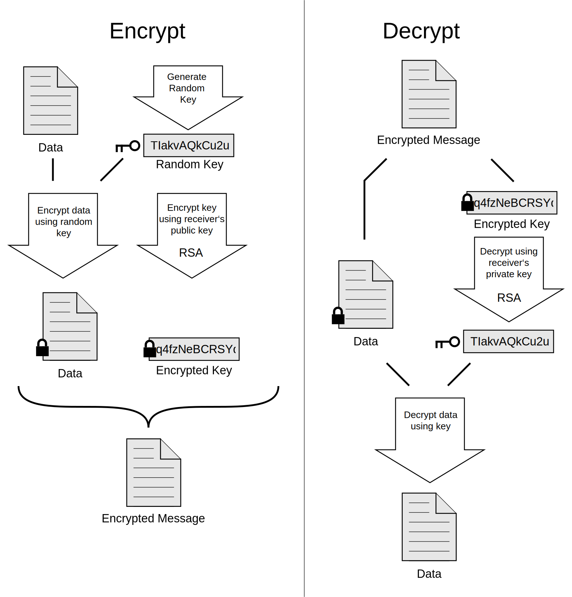

# How Pretty Good Privacy (PGP) works

Learn more about your [root key](pgp/root_key.md) and how [subkeys work](pgp/subkeys.md).

### PGP and GPG

> Pretty Good Privacy (PGP) is a data encryption and decryption computer program that provides cryptographic privacy and authentication for data communication. PGP is often used for signing, encrypting, and decrypting texts, e-mails, files, directories, and whole disk partitions and to increase the security of e-mail communications. It was created by Phil Zimmermann in 1991. 

> [Wikipedia](https://en.wikipedia.org/Pretty_Good_Privacy)

**Pretty Good Privacy (PGP)** has since been defined as a standard called OpenPGP. It's outlined in [RFC4880](https://tools.ietf.org/html/rfc4880).
[Requests For Comment](https://en.wikipedia.org/wiki/Request_for_Comments) at the <acroynm title="Internet Engineering Taskforce">IETF</acroynm> are standards documents even if the name doesn't immediately suggest it.

**GNU Privacy Guard (GPG)** also GnuPG. GPG is an implementation of OpenPGP and can be found on Linux, OS X and Windows.

 With PGP and GPG often they're used interchangeably. Don't be too concerned if you get them mixed up.
 When referring to PGP or GPG keys, everyone (including you now) knows you mean a public/private keypair.

Yes the names are confusing and probably counterproductive.

## PGP

PGP uses both asymmetric encryption and symmetric encryption. When encrypting a file (or message), the file is encrypted with a symmetric key, and the symmetric key is encrypted with asymmetric encryption.

Here's a diagram of how that works.

*Source: [PGP diagram.svg by xaedes & jfreax & Acdx](https://en.wikipedia.org/wiki/File:PGP_diagram.svg)*

Let break this down into the two main parts and explain how they work.

## **Symmetric Encryption**

Alice has a wants to encrypt a file. She puts it in a box with a lock. The `key` to the lock is `secret`. She keeps a copy of this `key` to unlock the box later.

Alice now wants the file she encrypted. She unlocks (decrypts) the box with her `key`.

Pretty simple, one `key` both encrypts and decrypts our box. Or to put it another way both the lock and key are `secret`.

### Benefits and Threats

Symmetric encryption has it's benefits, but it also has threats that prevent it usage in all cases.

Symmetric encryption is fast, much faster than asymmetric encryption.

If Alice decides to send a box locked with the key `secret` to Bob, she also needs to tell Bob the key. It's possible to use a different channel to send the key. In all cases the key has a high risk of exfiltration (theft), rendering the encryption useless.

Symmetric encryption by itself is dangerous, in that it's risky. But when paired with asymmetric encryption, we can use the benefits of both. This is what PGP does.

## **Asymmetric Encryption / Key Pairs**

Asymmetric encryption is different in that you need one `key` to encrypt and a different `key` to decrypt. The way this works is by using a mathematical function that is easy in one direction and hard in the other.

## Threats to PGP

You should be aware of of [Shor's Algorithm](https://en.wikipedia.org/wiki/Shor%27s_algorithm). It desrcibes a method that will break public key encryption very quickly. Effectively making the hard problem (decryption) and easy as the easy problem (encryption).

Naturally the NSA (and presumably other <acronym title="Three Letter Agencies">TLA</acronym>  are [working on being able to do this](https://www.washingtonpost.com/world/national-security/nsa-seeks-to-build-quantum-computer-that-could-crack-most-types-of-encryption/2014/01/02/8fff297e-7195-11e3-8def-a33011492df2_story.html). If this does become possible we will likely hear about it 5-10 years after it's discovered. If we're lucky we'll find out quickly.

The NSA also reporterdly records every PGP message they see, in the hope they can decrypt them later. Is they can solve Shor's Algorithm then they will be able to do this.
